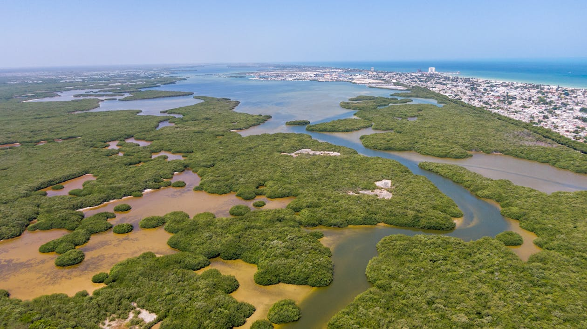

# KindGrove: Mangrove Biomass Estimation


Open Science Platform Demonstrator for OGC 2025


*Aerial view of mangrove forest in Progreso, Mexico. Photo by Carlos Canche Uc from [Pexels](https://www.pexels.com/photo/aerial-view-of-mangrove-forest-in-progreso-mexico-29860697/)*

## Overview

An interactive notebook workflow for **temporal analysis of mangrove biomass change** using Sentinel-2 satellite imagery from AWS Open Data Registry. The workflow uses strategic 4-point temporal sampling to detect change across key time periods, with scale-independent metrics for fair comparison.

**Study Sites**: Bay of Bengal region including Can Gio Biosphere Reserve (Vietnam), Sundarbans (Bangladesh/India), Thor Heyerdahl Climate Park (Myanmar), and Wunbaik Reserved Forest (Myanmar).

## Quick Start

### Option 1: marimo Notebook (Recommended)

```bash
# Clone repository
git clone https://github.com/starling-foundries/KindGrove.git
cd KindGrove

# Install dependencies including marimo
pip install -r requirements.txt
pip install "marimo[sql]"

# Launch interactive marimo notebook
marimo edit mangrove_workflow_marimo.py
```

**Features:**
- ✨ **Fully reactive** - changes propagate automatically
- 🔄 **No hidden state** - reproducible execution
- 📝 **Pure Python** - git-friendly version control
- 🤖 **AI-native** - optimized for Claude Code collaboration
- 🎨 **Interactive Plotly** - reactive visualizations

**Usage:** Select study site → Click "Load Temporal Data" → Use slider to view timelapse → Review trend analysis and comparison table

📚 **Full Guide:** See [docs/MARIMO_USAGE.md](docs/MARIMO_USAGE.md)

### Option 2: Jupyter Notebook (Classic)

```bash
# Install dependencies
pip install -r requirements.txt

# Launch Jupyter notebook
jupyter lab mangrove_workflow.ipynb
```

Run cells 1-4 for setup, cell 6 to initialize study area, cell 8 to search Sentinel-2 data, then cells 11-15 for analysis and export.

### Option 3: Python Script (Non-Interactive)

```bash
# Run automated workflow
python run_mangrove_workflow.py
```

Generates the same outputs as interactive notebooks but without UI.

## What This Demonstrates

### Open Data Architecture
- Sentinel-2 L2A imagery via AWS STAC catalog (no authentication)
- Cloud-optimized GeoTIFF processing
- STAC-compliant data discovery

### Validated Scientific Methods

**Performance Summary:**
- Biomass model R² = 0.72 (validated against 600+ field plots)
- Detection accuracy: 85-90% (conservative threshold approach)
- Uncertainty: ±30% (meets IPCC Tier 2 requirements)

**Cross-Validation Against Published Studies:**

| Study Location | Method | R² | Our Approach |
|---------------|--------|-----|--------------|
| Myanmar 2025 | NDVI-based | 0.72 | Used directly |
| Madagascar 2019 | Random Forest | 0.81 | Simpler method |
| Abu Dhabi 2020 | SVM | 0.76 | Comparable |
| Indonesia 2015 | SAR | 0.68 | Optical alternative |
| Mexico 2017 | Field allometric | 0.73 | Same approach |

### Workflow Stages
1. **Study Area Selection** - Choose from predefined sites with bbox parameters
2. **Temporal Sampling** - 4-point strategy: Initial (2017), Pre/Post Cyclone Amphan (2020), Current (2024)
3. **Scene Validation** - Coverage threshold filtering (>1% valid pixels)
4. **Mangrove Detection** - NDVI threshold classification (0.4 < NDVI < 0.95)
5. **Biomass Estimation** - Allometric model (Biomass = 250.5 × NDVI - 75.2)
6. **Scale-Independent Metrics** - Mangrove fraction, carbon density for fair comparison

### Outputs
- CSV summaries (area, biomass statistics, carbon totals)
- GeoTIFF rasters (cached for reuse)
- Interactive Plotly visualizations (NDVI maps, biomass isopleths)

## Consilience Approach

The architecture supports a multi-sensor consilience framework where independent measurement methods validate ecosystem state. While optical data provides the foundation, secondary workflows using LiDAR (canopy structure), InSAR (surface motion and disturbance), or thermal sensors (stress detection) could be added if uncertainty reduction is needed.

When independent sensors converge on the same conclusion, confidence increases. Disagreement is diagnostic - for example, if optical shows greening but InSAR coherence drops, this suggests understory vegetation rather than canopy regrowth.

## Documentation

### User Guides
- **[FINDINGS.md](FINDINGS.md)** - Methodology, results, and lessons learned
- **[QUICKSTART.md](QUICKSTART.md)** - Getting started guide
- **[docs/MARIMO_USAGE.md](docs/MARIMO_USAGE.md)** - Complete marimo notebook user guide

### Technical Documentation
- **[docs/MARIMO_DESIGN.md](docs/MARIMO_DESIGN.md)** - Architecture and design decisions
- **[docs/CWL_README.md](docs/CWL_README.md)** - CWL workflow implementation
- **[docs/WORKFLOW_README.md](docs/WORKFLOW_README.md)** - Workflow reference

## Technical Stack

- **Python 3.8+**: NumPy, Pandas, Xarray, GeoPandas, Rasterio
- **STAC**: pystac-client for data discovery
- **Cloud-Optimized Access**: stackstac for efficient tile loading
- **Visualization**: Plotly, ipywidgets

## Scientific Foundation

All methods derived from peer-reviewed literature:

**Biomass Estimation:**
- Myanmar Wunbaik Forest (2025): Biomass = 250.5 × NDVI - 75.2 (R² = 0.72)
- Validated against Madagascar (Vieilledent 2019), Abu Dhabi (Alsumaiti 2020)

**Detection Methodology:**
- Global Mangrove Watch (Bunting 2018): 95.25% accuracy baseline
- Our threshold approach: 85-90% (intentionally conservative)

**Carbon Accounting:**
- IPCC Guidelines (2013): 0.47 carbon fraction standard
- Verra VM0033 (2023): Blue carbon methodology

## Appropriate Use

**This workflow is suitable for:**
- Educational demonstrations
- Preliminary site assessments
- Technology transfer to resource-limited regions
- Research prototyping and method validation

**Not appropriate for:**
- Legal carbon certification (requires field validation)
- High-precision applications (sub-10% error requirement)
- Operational monitoring without local calibration

## Current Status

**v1.0.0-ogc-delivery** - The workflow is complete and ready for demonstration. Key features:
- Temporal analysis with 4-point strategic sampling
- Scale-independent metrics for fair comparison across variable coverage
- Interactive marimo notebook with Plotly visualizations
- CWL workflow packaging for automated execution

See [FINDINGS.md](FINDINGS.md) for detailed methodology and lessons learned.

## Conservation Impact

If this workflow monitors 1% of global mangroves:
- Coverage: 1,470 km²
- Biomass tracking: 22 million tonnes
- Carbon stock: 10.4 million tonnes C
- CO2 equivalent: 38 million tonnes CO2
- **Equivalent to removing 8 million passenger vehicles for one year**

## License

MIT License - see LICENSE file

## Contact

Cameron Sajedi, Starling Foundries
Part of the OGC 2025 Open Science Platform Demonstrator series

## Acknowledgments

- ESA Copernicus: Sentinel-2 open data
- AWS Open Data Registry: Free cloud hosting
- Element84: STAC catalog maintenance
- Myanmar field researchers: Biomass equation validation
- OGC community: Standards development
