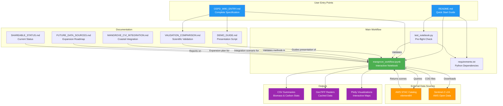
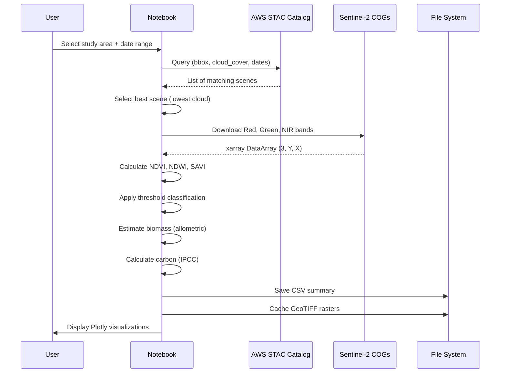

# Repository File Connections Diagram

This diagram shows how the files in the KindGrove repository are connected and used.



## File Dependency Flow

### Setup Phase
```
User → README.md
     → requirements.txt → pip install
     → test_notebook.py → Validates all dependencies
```

### Execution Phase
```
User → mangrove_workflow.ipynb
     → Cell 1-4: Setup (imports, config, study sites, global vars)
     → Cell 6: Initialize study area
     → Cell 8: Query STAC → Download Sentinel-2
     → Cell 11: Calculate indices → Detect mangroves
     → Cell 13: Estimate biomass
     → Cell 15: Export results → CSV, GeoTIFF, Plotly
```

### Documentation Flow
```
WIKI_ENTRY.md → Complete technical specification
              → References all other docs

DEMO_GUIDE.md → Step-by-step presentation
              → Uses WIKI_ENTRY for details

VALIDATION_COMPARISON.md → Scientific credibility
                         → Supports claims in WIKI_ENTRY

MANGROVE_CVI_INTEGRATION.md → Integration scenario
                             → Extends WIKI_ENTRY vision

FUTURE_DATA_SOURCES.md → Expansion roadmap
                        → 10 NASA/ESA data sources

SHAREABLE_STATUS.md → Current progress report
                    → Honest transparency
```

## Data Flow Through Workflow



## Key Connection Points

1. **requirements.txt** → Ensures all imports in `mangrove_workflow.ipynb` work
2. **test_notebook.py** → Validates `requirements.txt` before running notebook
3. **AWS STAC Catalog** → Provides scene metadata to notebook
4. **Sentinel-2 COGs** → Provides actual pixel data to notebook
5. **WIKI_ENTRY.md** → Master reference for all other documentation
6. **DEMO_GUIDE.md** → Translates WIKI technical details into presentation
7. **VALIDATION_COMPARISON.md** → Backs up scientific claims in WIKI
8. **FUTURE_DATA_SOURCES.md** → Extends WIKI vision with expansion roadmap
