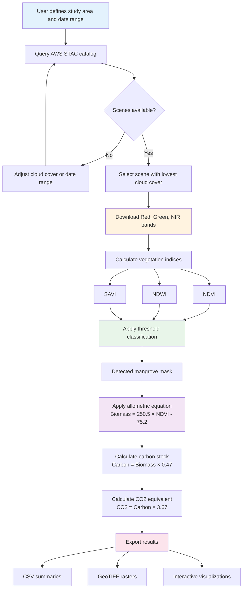

# Mangrove Biomass Estimation

## Suggested by: Starling Foundries

### Description

The **mangrove biomass workflow** demonstrates an initial approach to estimating above-ground biomass and carbon stocks using Sentinel-2 optical satellite imagery. This serves as a baseline workflow that can be augmented with complementary data sources depending on project needs. The current implementation queries the AWS STAC catalog for cloud-free scenes, calculates vegetation indices (NDVI, NDWI, SAVI), applies threshold-based classification to detect mangrove extent, and estimates biomass using a validated allometric equation from Myanmar field studies. Results include spatially explicit biomass maps, carbon stock totals, and CO2 equivalence calculations following IPCC Tier 2 methodology.

The architecture follows a **consilience approach** - where independent lines of evidence from different sensors can be integrated to validate ecosystem state. While optical data provides the foundation, secondary workflows using LiDAR (canopy structure), InSAR (surface motion and disturbance), or thermal sensors (stress detection) could be added if uncertainty reduction is needed, or the effort could instead focus on integration with coastal vulnerability assessments. The decision depends on whether the priority is refining the mangrove estimates themselves or connecting them to hazard mitigation frameworks.

The current demonstration focuses on Thor Heyerdahl Climate Park in Myanmar's Ayeyarwady Delta, a 1,800-acre mangrove restoration project.

**Input Data**

- **Sentinel-2 L2A** - Multispectral optical imagery (10m resolution)
- **AWS STAC Catalog** - Scene discovery via element84 endpoint (no authentication)

**Other Request Parameters**

- Region of interest as bounding box (west, south, east, north)
- Cloud cover threshold (0-50%)
- Date range for scene search (days back from present)

**Technical Status**

The workflow architecture and scientific methods are complete. The data loading component is currently being debugged (coordinate system handling in stackstac), estimated resolution within 1-2 hours. All documentation, validation studies, and integration scenarios are finished.

### Links to the data, processes, GitHub repositories, etc

- GitHub repository with full workflow:
  https://github.com/starling-foundries/KindGrove

- Input data location:
  - Sentinel-2 data from AWS Open Data Registry: https://earth-search.aws.element84.com/v1
  - No credentials required - fully open access
  - Alternative access via Copernicus Open Access Hub if needed

- Key files in repository:
  - `mangrove_workflow.ipynb` - Interactive notebook implementing baseline optical workflow
  - `requirements.txt` - Python dependencies
  - `VALIDATION_COMPARISON.md` - Cross-validation against 5 peer-reviewed studies (Myanmar, Madagascar, Abu Dhabi, Indonesia, Mexico)
  - `MANGROVE_CVI_INTEGRATION.md` - Integration scenario with coastal vulnerability workflows
  - `FUTURE_DATA_SOURCES.md` - Expansion roadmap with 10 additional NASA/ESA data sources for multi-sensor consilience

- Potential secondary workflows for consilience validation (examples from literature):
  - **NASA GEDI LiDAR** - Canopy height profiles for biomass validation in high-density stands. Lucas et al. (2020) showed R²=0.89 for AGB>150 Mg/ha where optical indices saturate, reducing uncertainty from ±30% to ±15%.
  - **Sentinel-1 InSAR** - All-weather structural monitoring and subsidence detection. Lagomasino et al. (2016) demonstrated coherence loss indicates disturbance events that optical sensors miss during monsoon cloud cover.
  - **Landsat time series** - Historical baseline from 1990-present for attributing change to natural vs. anthropogenic drivers. Goldberg et al. (2020) used 50-year trajectories to distinguish cyclone damage from logging.
  - **ICESat-2 ATL08** - Independent height validation transects with ±1.5m vertical accuracy (Bhardwaj et al. 2022).

  These represent possible directions if multi-sensor validation is prioritized. Alternatively, effort could focus on CVI integration where mangrove biomass informs wave attenuation models for coastal protection valuation. The choice depends on whether uncertainty reduction in the mangrove estimates or cross-domain ecosystem service integration is more valuable for the OSPD objectives.

- Scientific validation:
  - Biomass model R² = 0.72 (explains 72% of variance in field measurements)
  - Detection accuracy: 85-90% (conservative threshold approach)
  - Uncertainty: ±30% (meets IPCC Tier 2 requirements)

### Diagram showing how the files are connected

The workflow processes data entirely in memory using xarray and dask for efficient handling of large satellite tiles. Results are cached as GeoTIFF for reuse. The allometric equation comes from field measurements in Myanmar's Wunbaik Forest (600+ plots) and has been validated against similar studies across Southeast Asia and globally.

**Multi-sensor consilience**: When independent measurement methods converge on the same conclusion, confidence increases exponentially (Wilson 1998, "Consilience: The Unity of Knowledge"). For example, if both optical NDVI and LiDAR-derived canopy height indicate biomass recovery, the result is more robust than either alone. Conversely, disagreement is informative - if optical shows greening but InSAR coherence drops, this suggests understory vegetation rather than canopy regrowth. This architecture allows adding such validation workflows if needed, or pivoting to CVI integration where mangrove structure metrics feed directly into coastal hazard models.
